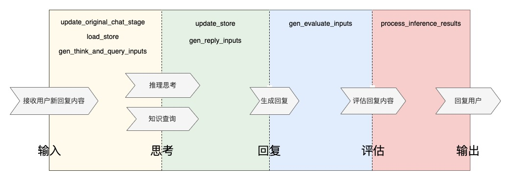

# FastChat-1.0(对话聊天应用开发框架)

> **更新时间**: 2024/04/30
>
> ---
> **项目组成员**:
> - <a href="timline://chat/?topin=qiaojiayang1">qiaojiayang1</a>

本项目是一款专为研发人员设计的对话聊天应用开发框架，它汲取了Vue.js、Angular等著名开发框架的设计精髓，将对话过程细分为思考推理、生成回复、结果反思三个阶段，构成了对话聊天的完整生命周期。在FastChat框架中，我们利用回调函数在生命周期的关键环节灵活调用研发人员编写的逻辑，极大简化了整体流程的设计复杂性。此外，框架提供了与Gradio前端、FastAPI接口、OpenAI知识库的便捷API集成，助力研发人员迅速部署和提供服务。为了进一步优化对话应用，我们还配备了批量测试功能，以及一套全面且自动化的日志记录与查询系统，确保研发人员能够高效地进行应用调优和问题诊断。


## 目录

### 模块及API介绍
- [对话生命周期理念介绍](#对话生命周期理念介绍)
- [ChatApplication-后台核心应用类](#class-chatapplication)
    - [init-构造函数](#def__init__)
    - [set_store_class-设定逻辑与数据寄存器的类](#def-set_store_class-须用户继承实现)
    - [initialize-核心应用构建时触发的方法](#def-initialize-须由用户继承实现)
    - [run-启动服务](#def-run)
    - [add_reply_module-添加对话回复模块方法](#def-add_reply_module)
    - [add_think_module-添加思考推理模块](#def-add_think_module)
    - [add_evaluate_module-添加回复评估模块](#def-add_evaluate_module)
    - [add_front_interface-添加前端交互模块](#def-add_front_interface)
    - [add_http_interface-添加http服务接口模块](#def-add_http_interface)
    - [add_query_module-添加知识查询模块](#def-add_query_module)
    - [think-执行推理思考](#def-think)
    - [query-执行知识查询](#def-query)
    - [reply-执行对话回复](#def-reply)
    - [evaluate-执行回复评估](#def-evaluate)
    - [request_preprocess-后台核心推理请求承接分配](#def-request_preprocess-须用户继承实现)
    - [inference-执行核心推理方法](#def-inference)
    - [update_original_chat_stage-获取原始的对话阶段](#def-update_original_chat_stage-须用户继承实现)
    - [load_store-载入逻辑与数据寄存器对象](#def-load_store-须用户继承实现)
    - [gen_think_and_query_inputs-生成思考推理和知识查询模块的入参](#def-gen_think_and_query_inputs-须用户继承实现)
    - [update_store-更新逻辑与数据寄存器对象](#def-update_store-须用户继承实现)
    - [gen_reply_inputs-生成对话回复模块的入参](#def-gen_reply_inputs-须用户继承实现)
    - [gen_evaluate_inputs-生成回复评估模块的入参](#def-gen_evaluate_inputs-须由用户继承实现)
    - [process_inference_results-处理后台核心应用的推理结果](#def-process_inference_results-须由用户继承实现)
- [ThinkModule-思考推理模块](#class-thinkmodule-srcbasethinkpy)
    - [init-构造函数](#def-__-init-__)
    - [initialize_prompt-定义提示词](#def-initialize_prompt-须用户继承实现)
    - [async_think-异步执行思考推理](#def-async_think)
    - [think-执行思考推理](#def-think-2)
    - [process_inference_results-处理思考推理的结果](#def-process_inference_results-须用户继承实现)
    - [setup-启动模块](#def-setup)
- [QueryModule-知识查询模块](#class-querymodule-srcbasequerypy)
    - [init-构造函数](#def-_-init-_)
    - [async_query-异步执行知识查询](#def-async_query)
    - [query-执行知识查询](#def-query-2)
    - [process_query_results-处理知识查询的结果](#def-process_query_results)
- [ReplyModule-对话回复模块](#class-replymodule-srcbasereplypy)
    - [init-构造函数](#def-__-init-__-2)
    - [initialize_prompt-定义提示词](#def-initialize_prompt-须用户继承实现-2)
    - [async_reply-异步执行对话回复](#async-def-async_reply)
    - [reply-执行对话回复](#执行对话回复)
    - [process_inference_results-处理对话回复的结果](#def-process_inference_results-须用户继承实现-2)
    - [setup-启动模块](#def-setup-2)
- [EvaluateModule-回复评估模块](#class-evaluatemodule-srcbaseevaluatepy)
    - [init-构造函数](#def-__-init-__-3)
    - [initialize_prompt-定义提示词](#def-initialize_prompt-须用户继承实现-3)
    - [async_evaluate-异步执行回复评估](#def-async_evaluate)
    - [evaluate-执行回复评估](#def-evaluate-2)
    - [process_inference_results-处理对话回复的结果](#def-process_inference_results-须由用户继承实现-3)
    - [setup-启动模块](#def-setup-3)
- [HttpInterface-http服务接口模块](#class-httpinterface-srcbasehttppy)
    - [define_request_format-接口请求数据的格式定义](#def-define_request_format-须用户继承实现)
    - [gen_request-生成请求后台核心应用的参数](#def-gen_request-须用户继承实现)
    - [process_inference_results-处理后台核心应用返回的结果](#def-process_inference_results-须用户继承实现-2)
- [FrontInterface-前端交互模块](#class-frontinterface-srcbasefrontpy)
    - [set_store_class-设置逻辑与数据寄存类](#def-set_store_class须用户继承实现)
    - [gen_request-生成请求后台核心应用的参数](#def-gen_request-须用户继承实现-2)
    - [update_store-更新逻辑与数据寄存器对象](#def-update_store-须用户继承实现-2)
    - [process_inference_results-处理后台核心应用返回的结果](#def-process_inference_results须用户继承实现)
- [Store-逻辑与数据寄存器类](#class-store-srcbasestorepy)
### 其它
- [批量测试功能](#批量测试功能)
- [日志查服务](#日志查询功能)
- [部署方式](#部署)
    - [容器/行云部署](#容器部署)
    - [本地部署](#本地部署)
- [Demo](#DEMO)
    - [demo的简介](#项目简介)
    - [demo的模块展示](#项目模块简介)
### 对话生命周期理念介绍

### class ChatApplication
核心应用模块融合了思考推理、对话回复、HTTP接口部署、前端交互部署以及知识库查询等多项功能，形成了一体化的集成解决方案。构建这一模块，便是启动整个项目应用的关键所在，确保了项目的顺畅运行与高效协作。
#### def__init__
核心应用的构造函数
```python
def __init__(self,
             application_name: str = 'dialog app',
             port: int = PORT,
             openai_api_key: str = AZURE_OPENAI_API_KEY,
             model_name: str = GPT_MODEL,
             temperature: float = 0,
             verbose: bool = False):
    """
    Args:
        application_name: 应用的名称
        port: 应用服务启动所在端口号
        openai_api_key: openai大模型调用的密钥
        model_name: 应用服务所调用的大模型编号(各模块未指定时使用核心应用所指定的大模型)
        temperature: 应用服务所调用的大模型的温度值(各模块未指定时使用核心应用所指定的温度值)
        verbose: 可忽略该参数(当前均打印详细的输出结果)
    """
```

#### def set_store_class (须用户继承实现)
指定对话应用当中所使用的逻辑与数据寄存的类

```python
def set_store_class(self) -> type:
    """
    Returns:
        对话应用当中所使用的逻辑与数据寄存的类
    """
```

#### def initialize (须由用户继承实现)
在应用服务启动时执行该方法，应用服务需要执行添加的对话回复模块、思考推理模块、知识查询模块、http服务接口和前端交互界面等配置操作，可在该方法当中执行完成。
```python
def initialize(self):
```

#### def run 
执行启动对话应用服务的方法，该方法在调用时会完成所有在initialize方法内添加的所有模块的加载操作，以及所有http接口模块、前端交互界面模块的启动操作。
```python
def run(self):
```

#### def add_reply_module
执行添加一个对话回复模块至核心应用当中，可由核心应用调用完成回复
```python
def add_reply_module(self, 
                     reply_module: ReplyModule, 
                     module_name: str = None, 
                     is_initial_stage: bool = False):
    """
    Args:
        reply_module: 对话回复模块
        module_name: 对话回复模块的名称标识(即对话阶段标识)
        is_initial_stage: 是否为起始对话阶段(若所有对话模块均为设置True，以第一个执行添加的模块作为起始阶段)
    """
```

#### def add_think_module
执行添加一个思考推理模块至应用当中，可由核心应用调用来完成思考推理
```python
def add_think_module(self,
                     think_module: ThinkModule,
                     module_name: str = None,
                     white_list: list[str] = None,
                     black_list: list[str] = None):
    """
    Args:
        think_module: 思考推理模块
        module_name: 思考推理模块的名称标识
        white_list: 当前模块允许执行的对话阶段列表，在未指定的对话阶段内不执行
        black_list: 当前模块不允许执行的对话阶段列表，在未指定的对话阶段内执行
    
    white_list和black_list均未指定时，该模块在所有对话阶段内均执行
    """
```

#### def add_evaluate_module
执行添加一个回复结果质量评估模块至应用当中，可由核心应用调用来完成结果评估
```python
def add_evaluate_module(self,
                        evaluate_module: EvaluateModule,
                        module_name: str = None,
                        white_list: list[str] = None,
                        black_list: list[str] = None):
    """
    Args:
        evaluate_module: 回复评估模块
        module_name: 回复评估模块的名称标识
        white_list: 当前模块允许执行的对话阶段列表，在未指定的对话阶段内不执行
        black_list: 当前模块不允许执行的对话阶段列表，在未指定的对话阶段内执行
    
    white_list和black_list均未指定时，该模块在所有对话阶段内均执行
    """
```


#### def add_front_interface
执行向对话应用当中添加前端交互界面模块
```python
def add_front_interface(self, 
                        front_interface: FrontInterface, 
                        module_name: str, 
                        path: str = '/'):
    """
    Args:
        front_interface: 前端交互界面模块
        module_name: 前端交互界面模块的名称标识
        path: 前端界面所绑定的URL地址的后缀名
    """
```

#### def add_http_interface
执行向对话应用当中添加一个http接口服务模块
```python
def add_http_interface(self, 
                       http_interface: HttpInterface, 
                       path: str, 
                       module_name: str = None):
    """
    Args:
        http_interface: http接口服务模块
        path: http接口服务所加载的URL后缀
        module_name: http服务接口模块的名称标识
    """
```

#### def add_query_module
执行向对话应用当中添加知识查询模块
```python
add_query_module(self,
                 query_module: QueryModule,
                 module_name: str,
                 variable_name: str,
                 query_field: str,
                 top_k: int,
                 result_fields: List[str],
                 min_score: float = None,
                 white_list: list[str] = None,
                 black_list: list[str] = None):
    """
    Args:
        query_module:  知识查询模块
        module_name: 该知识查询模块的名称标识
        variable_name: 类似于对话回复、思考推理模块的提示词占位符，用于知识查询比对的变量名
        query_field: 与知识库内进行向量比较的字段
        top_k: 返回的相似度最高的结果数量
        result_fields: 知识库用于作为查询返回结果的字段
        min_score: 查询返回结果的最低要求的相似度的值(不指定时没有最低相似度数值的要求)
        white_list: 当前模块允许执行的对话阶段列表，在未指定的对话阶段内不执行
        black_list: 当前模块不允许执行的对话阶段列表，在未指定的对话阶段内执行
        
        white_list和black_list均未指定时，该模块在所有对话阶段内均执行        
    """
```

#### def think
执行推理思考

```python
async def think(self,
                think_module_names: List[str] = None,
                is_return_async_tasks: bool = False, 
                **kwargs) -> Union[Dict, list]:
    """
    Args:
        think_module_names: 指定参与本次思考推理的模块的模块名称标识列表
        is_return_async_tasks: 是否返回异步执行的任务列表(False时返回异步执行的结果)
        kwargs: 指定的思考推理模块的提示词当中的占位符对应的实际取值
    Returns:
        参与本次推理的各个思考推理模块的执行结果
    """
```

#### def query
执行知识查询

```python
async def query(self,
                query_module_names: List[str] = None,
                is_return_async_tasks: bool = False,
                **kwargs) -> Union[Dict[str, Any], List[Any]]:
    """
    Args:
        query_module_names: 当前执行知识查询的知识查询模块的名称标识列表
        is_return_async_tasks: 是否返回异步执行的任务列表(False时返回异步执行的结果)
        kwargs: 各个知识查询模块的执行查询方法的入参参数
    Returns:
        各个知识查询的结果或者各个知识查询模块的异步查询任务列表
    """
```

#### def reply
执行生成回复内容，该方法会启动current_stage变量所指定的对话回复模块来生成回复
```python
async def reply(self, **chat_module_inputs) -> str
    """
    Args:
        chat_module_inputs: 各对话模块儿的提示词内的占位符所对应的实际取值
    
    Returns: 
        current_stage所指定的对话回复模块执行生成的回复结果
    """
```

#### def request_preprocess (须用户继承实现)
指定方法负责接收到前端交互、http接口模块的调用请求，通常使用self.inference即可，你也可以自己实现一个新的方法来负责处理用户的请求。
```python
def request_preprocess(self, request_inputs: Dict) -> Callable:
    """
    Args:
        request_inputs: 请求核心应用服务的参数
    Returns:
        指定负责处理当前请求的方法
    """
```

#### def inference
定制的生成回复内容的推理方法，执行过程中的各个特定节点调用由研发人员实现的方法
```python
def inference(self, *args, **kwargs) -> Any:
```

#### def update_original_chat_stage (须用户继承实现)
返回的结果是执行inference的开始时的对话阶段，需要从请求的参数inference_inputs当中去获取原始的对话阶段。
```python
def update_original_chat_stage(self, inference_inputs: Dict) -> str:
    """
    Args:
        inference_inputs: 执行inference方法时的入参参数
    Returns:
          开始执行inference方法推理时的对话阶段
    """
```

#### def load_store (须用户继承实现)
载入对话应用当中所使用的逻辑与数据寄存的对象
```python
def load_store(self, inference_inputs: Dict, store: Store) -> Store:
    """
    Args:
        inference_inputs: 执行inference推理方法的入参参数
        store: 逻辑与数据寄存的对象，存活于执行inference推理的整个生命周期内
    Returns:
        重新载入的逻辑与数据寄存的对象
    """
```

#### def gen_think_and_query_inputs (须用户继承实现)
生成各个思考推理模块的提示词占位符的实际取值、各个知识查询模块的入参参数
```python
def gen_think_and_query_inputs(self, 
                               store: Store, 
                               inference_inputs: Dict) -> Dict:
    """
    Args:
        store: 逻辑与数据寄存的对象，存活于执行inference推理的整个生命周期内
        inference_inputs: 执行inference推理方法的入参参数
    Returns:
        各个思考推理模块的提示词占位符的实际取值、各个知识查询模块的入参参数
    """
```

#### def update_store (须用户继承实现)
在执行完思考推理和知识查询之后的这一时间节点，基于思考推理、知识查询的结果来更新store对象，将核心的数据寄存在store当中，便于在后续的特定时间节点来使用。
```python
def update_store(self,
                 store: Store,
                 think_results: Dict,
                 query_results: Dict,
                 original_chat_stage: str,
                 inference_inputs: Dict) -> Store:
    """
    Args:
        store: 逻辑与数据寄存的对象，存活于执行inference推理的整个生命周期内
        think_results: 各个思考推理模块执行所返回的结果
        query_results: 各个知识查询模块执行所返回的结果
        original_chat_stage: 执行inference推理之前的原始对话阶段
        inference_inputs:  执行inference推理方法的入参参数
    Returns:
        完成更新后的store对象
    """
```

#### def gen_reply_inputs (须用户继承实现)
生成各个对话回复模块的提示词当中的各占位符所对应的实际取值，返回结果将作为调用当前current_chat_stage所指定的对话回复模块的占位符的实际取值，进而执行对话回复模块来生成回复结果。
```python
def gen_reply_inputs(self,
                           current_chat_stage: str,
                           store: Store,
                           think_results: Dict,
                           query_results: Any,
                           original_chat_stage: str,
                           inference_inputs: Dict) -> Dict:
    """
    Args:
        current_chat_stage: 当前更新后并对话阶段，也即负责执行生成回复结果的对话回复模块的名称标识
        store: 逻辑与数据寄存的对象，存活于执行inference推理的整个生命周期内
        think_results: 各个思考推理模块执行所返回的结果
        query_results: 各个知识查询模块执行所返回的结果
        original_chat_stage: 执行inference推理之前的原始对话阶段
        inference_inputs: 执行inference推理方法的入参参数
    Returns:
        各个对话模块的占位符所对应的实际取值，建议返回所有对话模块的入参，执行时仅取对应对话回复模块的入参。
    """
```

#### def gen_evaluate_inputs (须由用户继承实现)
在完成对话内容的生成后，自动调用该方法返回结果作为各结果评估模块的占位符输入，当未配置结果评估模块时，跳过执行结果评估，直接将当前方法返回的结果传递给下一步骤的process_inference_results方法
```python
def gen_evaluate_inputs(self,
                        reply_results: Any,
                        current_chat_stage: str,
                        store: Store,
                        think_results: Dict,
                        query_results: Dict,
                        original_chat_stage: str,
                        inference_inputs: Dict
                        ) -> Any:
    """
    Args:
        reply_results: 对话回复模块执行返回的结果
        current_chat_stage: 当前的对话阶段(以对话回复模块的标识作为对话阶段的命名标识)
        store: 逻辑与数据寄存的对象，存活于执行inference推理的整个生命周期内
        think_results: 各思考推理模块执行返回的结果
        query_results: 各知识查询模块执行返回的结果
        original_chat_stage: 执行inference前的对话阶段(以对话回复模块的标识作为对话阶段的命名标识)
        inference_inputs: 执行inference推理方法的入参参数   
    
    Returns: 
        当配置评估模块时，返回结果将作为评估模块的占位符入参使用。未配置时，则返回结果直接作为process_inference_results方法的参数evaluate_results的取值。
    """
```

#### def process_inference_results (须由用户继承实现)
执行inference对话推理的最后一个时间节点，你可以在这个方法当中基于各个时间节点产出的完整数据来组装生成一个符合前端交互界面及http接口模块所需要的返回结果。
```python
def process_inference_results(self,
                              evaluate_results: Dict,
                              reply_results: Any,
                              current_chat_stage: str,
                              store: Store,
                              think_results: Dict,
                              query_results: Dict,
                              original_chat_stage: str,
                              inference_inputs: Dict) -> Any:
    """
    Args:
        evaluate_results: 回复结果评估模块执行返回的结果(未配置时，方法gen_evaluate_inputs方法的返回结果直接传递给该参数)
        reply_results: 各对话回复模块执行所返回的结果
        current_chat_stage: 当前最新的对话阶段(以执行对话回复的模块的名称标识作为对话阶段的标识)
        store: 逻辑与数据寄存的对象，存活于执行inference推理的整个生命周期内
        think_results: 各个思考推理模块执行所返回的结果
        query_results: 各个知识查询模块执行所返回的结果
        original_chat_stage: 执行inference推理之前的原始对话阶段
        inference_inputs: 执行inference推理方法的入参参数
    Returns:
        符合与http接口模块儿及前端交互界面所需要的数据内容        
    """
```


#### def evaluate
执行对于回复结果的评估
```python
async def evaluate(self,
                   evaluate_module_inputs: Dict,
                   is_return_async_tasks=False,
                   evaluate_module_names: list = None) -> Union[Dict, Tuple[list, list]]:
    """
    Args:
        evaluate_module_inputs
    """
```

### class ThinkModule (src/base/think.py)
思考推理模块，在生成回复内容之前基于请求数据生成思考推理的结果，如捕捉对话当中所出现的关键信息，用于更好地组织回复的内容。

#### def __ _init_ __
构造函数，生成对话回复模块的实例对象
```python
def __init__(self,
             model_name: str = None,
             temperature: float = None,
             openai_api_key: str = None,
             verbose: bool = None):
    """
    Args:
        model_name: 当前模块指定使用的大模型的名称标识(未指定时使用核心应用配置的大模型)
        temperature: 大模型的温度值(未指定时使用核心应用配置的温度值)
        openai_api_key: 访问大模型api接口的密钥
        verbose: 可忽略该参数
    """
```

#### def initialize_prompt (须用户继承实现)
定义提示词，本方法返回的结果作为大模型执行所依据的提示词内容。
```python
def initialize_prompt(self) -> str:
    """
    Returns:
        思考推理模块的提示词
    """
```


#### def async_think 
异步执行思考推理
```python
async def async_think(self, **kwargs) -> Any:
    """
    Args:
        kwargs: 思考推理模块提示词内占位符对应的实际取值
    Returns:
        当前模块执行思考推理的结果
    """
```

#### def think
执行推理思考
```python
def think(self, **kwargs) -> Any:
    """
    Args:
        kwargs: 思考推理模块提示词内占位符对应的实际取值
    Returns:
        当前模块执行思考推理的结果
    """
```

#### def process_inference_results (须用户继承实现)
处理大模型执行所返回的结果，处理后的结果作为当前模块执行思考推理所返回的结果。
```python
def process_inference_results(self, inference_results: Any) -> Any:
    """
    Args:
        inference_results: 大模型执行所返回的结果
    Returns:
        当前模块执行思考推理最终返回的结果
    """
```

#### def setup
启动模块，执行该方法后才能实际运行生成对话回复
```python
def setup(self,
          llm: MyChatOpenAI = None,
          verbose: bool = False):
    """
    Args:
        llm: 大模型，支撑当前模块完成对话回复(可以不用设定，在构造函数当中指定好大模型相关的参数即可)
        verbose: 可忽略
    """
```

### class QueryModule (src/base/query.py)
知识查询模块，便捷对接OPENAI知识库
#### def _ _init_ _
构建生成知识查询模块
```python
def __init__(self,
             openai_api_key=None,
             embed_type=EMBEDDING_MODEL_TYPE,
             embed_model=EMBEDDING_MODEL_NAME,
             chunk_size=1,
             max_retries=6,
             master_url=VEARCH_CONFIG.get('master_url', ''),
             router_url=VEARCH_CONFIG.get('router_url', ''),
             db_name=VEARCH_CONFIG.get('db_name', ''),
             space_name=VEARCH_CONFIG.get('space_name', '')):
    """
    Args:
        openai_api_key: OpenAI访问使用的密钥 (未设定时使用对话应用配置的密钥)
        embed_type: 编码向量方式
        embed_model: 编码模型
        chunk_size: 块大小
        max_retries: 最大尝试次数
        master_url: 主url
        router_url: 路由url
        db_name: 数据库名称
        space_name: 空间名称
    """
```

#### def async_query
异步执行知识查询
```python
async def async_query(self,
                      query_content: str,
                      query_field: str,
                      top_k: int,
                      result_fields: list[str],
                      min_score: float = None):
    """
    Args:
        query_content: 用于查询的内容
        query_field: 用于和查询内容进行向量相似度比对的字段
        top_k: 查询返回的最相似的结果数量
        result_fields: 知识库查询返回的结果字段
        min_score: 要求返回结果的与查询内容的相似度的下限值(不设定时则不要求返回结果的相似度)
    Returns:
        查询结果
    """
```

#### def query
执行知识查询
```python
def query(self,
          query_content: str,
          query_field: str,
          top_k: int,
          result_fields: list[str],
          min_score: float = None)->Any:
    """
    Args:
        query_content: 用于查询的内容
        query_field: 用于和查询内容进行向量相似度比对的字段
        top_k: 查询返回的最相似的结果数量
        result_fields: 知识库查询返回的结果字段
        min_score: 要求返回结果的与查询内容的相似度的下限值(不设定时则不要求返回结果的相似度)
    Returns:
        查询结果
    """
```

#### def process_query_results
处理知识查询的结果，处理之后的结果返还给后台核心应用来使用
```python
def process_query_results(self, query_content: str, query_results: list) -> Any:
    """
    Args:
        query_content: 查询内容
        query_results: 知识库查询的结果
    Returns:
        返还给后台核心应用来使用的处理之后的结果
    """
```

### class ReplyModule (src/base/reply.py)
对话回复模块，负责生成对话回复的内容

#### def __ _init_ __
构造函数，生成对话回复模块的实例对象
```python
def __init__(self,
             model_name: str = None,
             temperature: float = None,
             openai_api_key: str = None,
             verbose: bool = None):
    """
    Args:
        model_name: 当前模块指定使用的大模型的名称标识(未指定时使用核心应用配置的大模型)
        temperature: 大模型的温度值(未指定时使用核心应用配置的温度值)
        openai_api_key: 访问大模型api接口的密钥
        verbose: 可忽略该参数
    """
```

#### def initialize_prompt (须由用户继承实现)
定义提示词，本方法返回的结果作为大模型执行所依据的提示词内容。
```python
def initialize_prompt(self) -> str:
    """
    Returns:
        思考推理模块的提示词
    """
```

#### async def async_reply
异步执行对话回复
```python
async def async_reply(self, **kwargs) -> Any:
    """
    Args:
        kwargs: 对话回复模块的提示词内各占位符对应的实际取值
    Returns:
        大模型执行生成的初步的回复内容
    """
```

#### def reply
执行对话回复
```python
def reply(self, **kwargs) -> Any:
    """
    Args:
        kwargs: 对话回复模块的提示词内各占位符对应的实际取值
    Returns:
        大模型执行生成的初步的回复内容
    """
```

#### def process_inference_results (须由用户继承实现)
处理大模型执行所返回的结果，处理后的结果作为当前模块执行思考推理所返回的结果。
```python
def process_inference_results(self, inference_results: Any) -> Any:
    """
    Args:
        inference_results: 大模型执行所返回的结果
    Returns:
        当前模块执行思考推理最终返回的结果
    """
```

#### def setup
启动模块，执行该方法后才能实际运行生成对话回复
```python
def setup(self,
          llm: MyChatOpenAI = None,
          verbose: bool = False):
    """
    Args:
        llm: 大模型，支撑当前模块完成对话回复(可以不用设定，在构造函数当中指定好大模型相关的参数即可)
        verbose: 可忽略
    """
```

### class EvaluateModule (src/base/evaluate.py)
回复结果评估模块,负责评估对话回复模块生成回复的质量
#### def __ _init_ __
构造函数，生成对话回复模块的实例对象
```python
def __init__(self,
             model_name: str = None,
             temperature: float = None,
             openai_api_key: str = None,
             verbose: bool = None):
    """
    Args:
        model_name: 当前模块指定使用的大模型的名称标识(未指定时使用核心应用配置的大模型)
        temperature: 大模型的温度值(未指定时使用核心应用配置的温度值)
        openai_api_key: 访问大模型api接口的密钥
        verbose: 可忽略该参数
    """
```

#### def initialize_prompt （须由用户继承实现）
定义提示词，本方法返回的结果作为大模型执行所依据的提示词内容。
```python
def initialize_prompt(self) -> str:
    """
    Returns:
        思考推理模块的提示词
    """
```

#### def async_evaluate
异步执行回复结果评估
```python
async def async_evaluate(self, **kwargs):
    """
    Args:
        kwargs: 回复评估模块的提示词内各占位符对应的实际取值
    Returns:
        大模型执行生成的回复评估结果
    """
```
#### def evaluate
执行回复结果评估
```python
def evaluate(self, **kwargs):
    """
    Args:
        kwargs: 回复评估模块的提示词内各占位符对应的实际取值
    Returns:
        大模型执行生成的回复评估结果
    """
```

#### def process_inference_results (须由用户继承实现)
处理大模型执行所返回的结果，处理后的结果作为当前模块执行思考推理所返回的结果。
```python
def process_inference_results(self, inference_results: Any) -> Any:
    """
    Args:
        inference_results: 大模型执行所返回的结果
    Returns:
        当前模块执行思考推理最终返回的结果
    """
```

#### def setup
启动模块，执行该方法后才能实际运行生成对话回复
```python
def setup(self,
          llm: MyChatOpenAI = None,
          verbose: bool = False):
    """
    Args:
        llm: 大模型，支撑当前模块完成对话回复(可以不用设定，在构造函数当中指定好大模型相关的参数即可)
        verbose: 可忽略
    """
```

### class HttpInterface (src/base/http.py)
http接口服务模块，可便捷部署http接口服务

#### def define_request_format （须用户继承实现）
定义http接口服务的接口请求的数据格式
```python
def define_request_format(self) -> type:
    """
    Returns:
        继承自BaseModel的类
    """
```

#### def gen_request (须用户继承实现)
处理http服务接口接收到的网络请求，处理返回的结果作为请求核心应用的参数
```python
def gen_request(self, req: Dict) -> Dict:
    """
    Args:
        req: 接口的网络请求数据
    Returns:
        向对话核心应用转发的请求参数
    """
```

#### def process_inference_results (须用户继承实现)
处理核心应用接收请求后执行的结果，处理后的结果作为http服务接口最终返回的结果
```python
def process_inference_results(self, inference_results: Any) -> Any:
    """
    Args:
        inference_results: 核心应用推理并返回的结果
    Returns:
        http服务接口最终返回的结果
    """
```

### class FrontInterface (src/base/front.py)
前端界面交互，基于gradio实现的简单前端界面，便捷实现前端交互功能，便于快速落地应用并检验算法效果。

#### def set_store_class（须用户继承实现）
设置前端的逻辑与数据寄存的类
```python
def set_store_class(self) -> type:
    """
    Returns:
        前端交互所需要的逻辑与数据寄存的类
    """
```
#### def gen_request （须用户继承实现）
基于聊天内容和前端寄存的数据，生成向后台核心应用请求的参数数据
```python
def gen_request(self, 
                chat_contents: List, 
                user_reply: str, 
                store: Store) -> Dict:
    """
    Args:
        chat_contents: 前端聊天框内的聊天数据
        user_reply: 用户在前端最新输入的内容
        store: 前端的逻辑与数据寄存器对象(生命周期为一次完整的多轮聊天)
    Returns:
        向核心应用请求的参数数据
    """
```

#### def update_store （须用户继承实现）
更新前端的逻辑与数据寄存器对象
```python
def update_store(self, 
                 inference_results: Any, 
                 store: Store) -> Store:
    """
    Args:
        inference_results: 后台核心应用执行返回的结果
        store: 前端的逻辑与数据寄存器对象(生命周期为一次完整的多轮聊天)
    Returns:
        数据更新后的前端的逻辑与数据寄存器对象
    """
```

#### def process_inference_results（须用户继承实现）
处理后台核心应用执行返回的结果，处理后的结果作为在前端聊天框内进行展示的内容。
```python
def process_inference_results(self, 
                              inference_results: Any, 
                              store: Store) -> str:
    """
    Args:
        inference_results: 后台核心应用执行返回的结果
        store: 前端的逻辑与数据寄存器对象(此时已经更新，生命周期为一次完整的多轮聊天)
    Returns:
        在前端聊天框内进行展示的文本内容
    """
```

### class Store (src/base/store.py)
逻辑与数据寄存器，为前端与后台核心应用提供所需要的用于存储数据，以及执行方法。本类是一个没有任何属性定义和方法定义的抽象类，为研发人员提供了极大的自由空间。研发人员在Store的子类当中定义任意需要的变量和方法，你可以在后台核心应用执行的特定回调方法当中使用你实现的Store子类当中的属性变量和方法。

## 批量测试功能

您需要按照该格式来准备测试数据`description`字段用来描述当前的测试样例的问题，`data`字段用于存放实际的请求数据。

```json
{
  "客户提问回应/回复异常": {
    "description": "客户询问是否能够有优惠，未能合理回复",
    "data": {
     
    },
    "...更多的测试用例": {}
  }
}
```

通过调用[`test.py`](./test.py)中的test函数，完成向指定接口批量发送请求数据的目的。

```python
import json

test(url='http://127.0.0.1:18868/chat',
     test_json_file='data/json/test.json',
     test_case_keys=["http联通性测试"],
     test_case_prefixs=[],
     result_path='data/result',
     batch_size=3)
```

## 日志查询功能
你无须在项目当中编写任何与日志记录相关的代码，我们已经针对所有模块的调用时的入参和出参，甚至耗时都进行了十分严密的日志监控。因此你只需要使用好日志查询的功能即可。日志记录关键信息有以下内容。

```markdown
方法调用时的入参参数
对话应用的名称
方法名
方法所属类名
模块名
模块类型
方法的输出结果
```
通过调用`request_log.py`当中的request_log函数实现日志数据查询的目的。
```python
asyncio.run(request_log(urls=['http://127.0.0.1:18868/log'],
                            time_zone=('2024-04-29 23:38:00', '2024-04-30 00:30:00'),
                            query_contents=["特斯拉", "inference"]))
```

## 部署

### 容器部署

行云部署是您启动本系统的最佳选择! 您可以在[`Dockerfile`](./Dockerfile)中自定义各类环境变量

### 本地运行

运行以下`shell`脚本在本地启动本系统. 推荐您使用Python3.9+以上版本

```shell
# # run conda, venv ... to create and activate virtual environment
pip install -r requirements.txt

python3 generator.py
```

## DEMO
### 项目简介
在本项目当中我们编写了一个简单的演示案例，用于帮助你快速上手。演示案例是京东物流机器人收集客户的基本物流信息，将收集到的物流信息作为销售参考的重要内容。项目启动的方式为执行`main.py`文件。

### 项目模块简介
```python
src
├── apps
│   └── app_qw.py # demo的后台核心应用层实现
├── base
│   ├── app.py
│   ├── chain.py
│   ├── evaluate.py
│   ├── front.py
│   ├── http.py
│   ├── log.py
│   ├── module.py
│   ├── openai.py
│   ├── query.py
│   ├── reply.py
│   ├── service.py
│   ├── store.py
│   ├── think.py
│   └── utils.py
├── config.py
├── evaluates
│   └── evaluate_reply.py # demo的回复结果评估模块
├── fronts
│   └── front_qw.py # demo的前端交互模块
├── https
│   └── chat_qw.py # demo的http服务接口模块
├── querys
│   └── jd_query.py # demo的知识查询模块
├── replys
│   ├── additional_ask.py # demo追加询问物流信息的对话模块/阶段
│   ├── conclude_info.py # demo信息确认与总结阶段的对话模块/阶段
│   ├── end_conversation.py # demo结束阶段的对话模块/阶段
│   └── greeting.py # demo问候阶段的对话模块/阶段
├── stores
│   ├── store_for_qw.py # demo后台核心应用层所使用的逻辑与数据寄存器类
│   └── store_front.py # demo前端交互模块所使用的逻辑与数据寄存器类
├── thinks
│   ├── collect_info.py # demo的负责信息收集的思考推理模块
│   ├── info_confirm.py # demo的负责判断用户信息确认意向的思考推理模块
│   └── tmp_collect_info.py # demo的仅根据用户最新反馈信息进行信息收集的思考推理模块
└── utils.py

```


## 联系方式

您可以直接通过<a href="timline://chat/?topin=qiaojiayang1">京东ME</a>发起讨论。如果您目前不方便登录,
也可以通过<a href="mailto://qiaojiayang1@jd.com">邮箱</a>联系我。